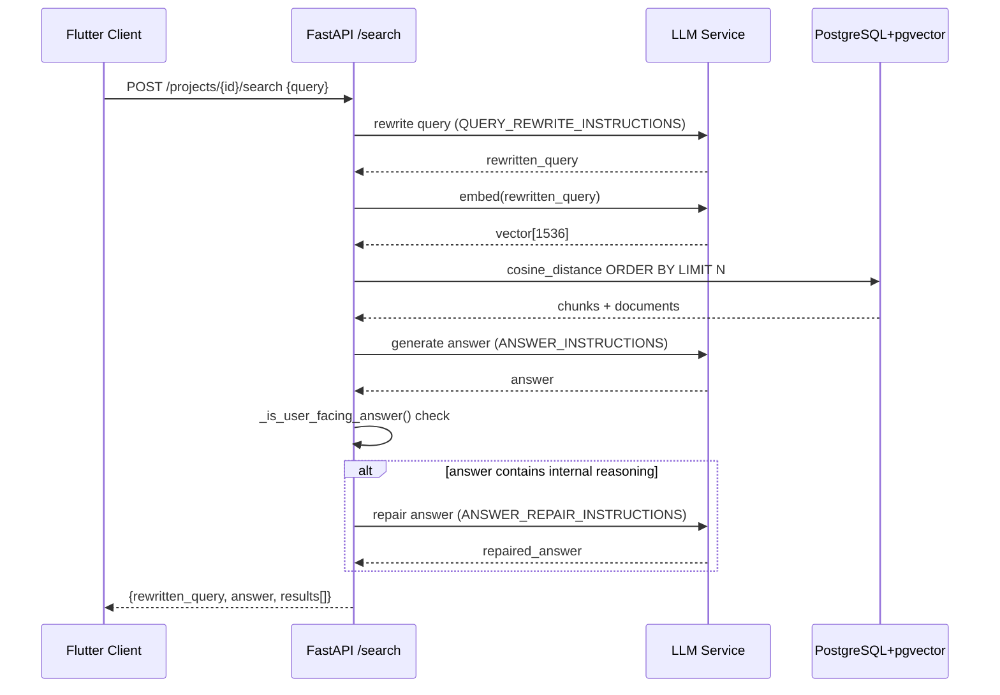

# RAG Search Flow — Sequence Diagram

This document describes the end-to-end request flow for the `/projects/{project_id}/search` endpoint,
from the Flutter client through the FastAPI backend to the LLM service and PostgreSQL (pgvector).

## Sequence Diagram

## Flow Description

| Step | Component | Detail |
|------|-----------|--------|
| 1 | Flutter → API | POST with `{query, limit}` payload, authenticated via Bearer session token |
| 2 | API → LLM | Query rewrite using `QUERY_REWRITE_INSTRUCTIONS` — produces a concise semantic search string |
| 3 | API → LLM | Embed the rewritten query via `embed_texts()` |
| 4 | API → PG | `cosine_distance` search on `DocumentChunk.embedding`, filtered by project/owner/status |
| 5 | API → LLM | Generate user-facing answer from retrieved context using `ANSWER_INSTRUCTIONS` |
| 6 | API (internal) | `_is_user_facing_answer()` guards against leaking internal reasoning markers |
| 7 (conditional) | API → LLM | If the answer fails the guard, a repair prompt (`ANSWER_REPAIR_INSTRUCTIONS`) is issued |
| 8 | API → Flutter | Returns `SearchResponse` with `rewritten_query`, `answer`, and `results[]` |

## Key Source Files

- Backend route: [`backend/app/api/v1/routes/search.py`](../backend/app/api/v1/routes/search.py)
- LLM service: [`backend/app/services/llm.py`](../backend/app/services/llm.py)
- Embedding service: [`backend/app/services/embedding.py`](../backend/app/services/embedding.py)
- Flutter client: [`frontend/lib/services/api_client.dart`](../../frontend/lib/services/api_client.dart)

## Known Issues & Mitigations

> [!WARNING]
> `generate_text()` uses `time.sleep()` for overload retries. This is a **synchronous blocking call**
> inside a Uvicorn worker and will stall all concurrent requests during retry back-off.
> See `llm.py` `_retry_after_overload()`.

> [!NOTE]
> Answer repair is a two-shot LLM call with a hard failure on the second attempt.
> If both calls return internal reasoning, the endpoint returns HTTP 503 — this is intentional
> to prevent surfacing hallucinated or malformed answers to users.
